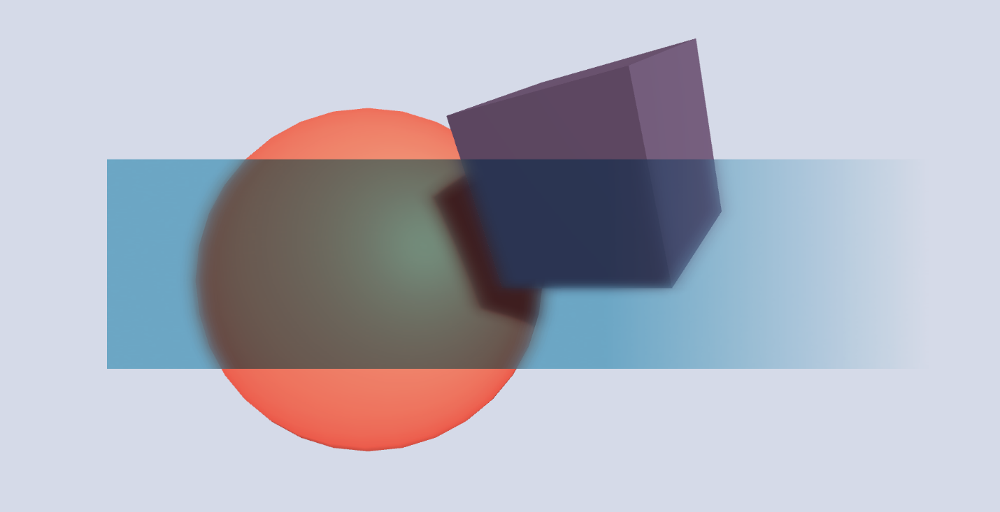
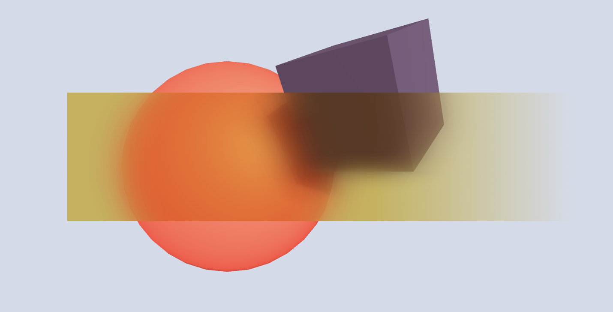
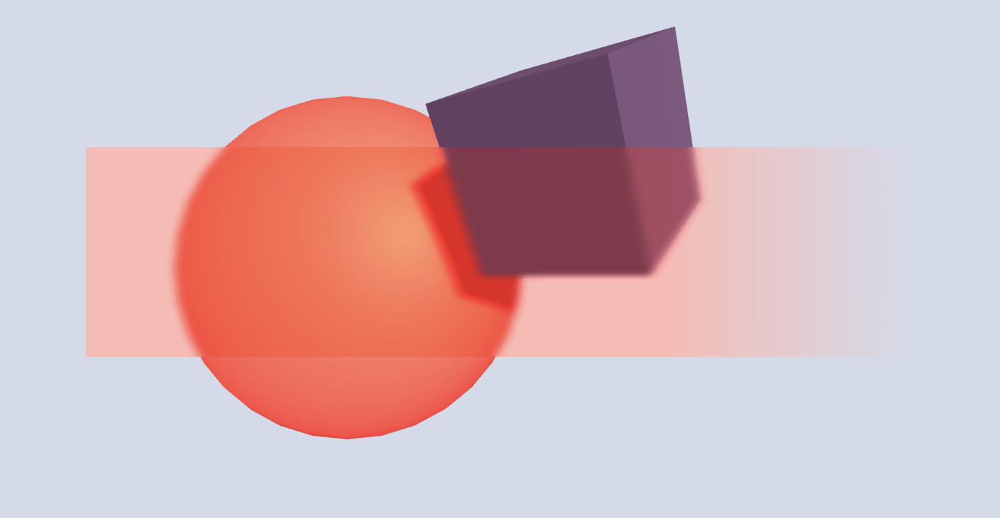

# UI Blur Shader 2020

Lightweight shader giving UI the glassy 'background blur' effect in any project with a camera that can render to RenderTexture.

### Pros

- Compatible with URP, 2D Renderer, LWRP, and Unity 2020.1 (and previous versions)
- Performant
  - No Grab Pass/Graphics.Blit
  - Perform all math in the shader code which contains two nested for-loops of max O(Max Radius / Min Steps \* 5) = 106 operations; get good results with radius = 30, step = 4, of 37 operations
- Customizable - Play with the sliders on the UIBlur material
- Maskable, Clippable, Tintable - Based on [UI/Default shader](https://github.com/TwoTailsGames/Unity-Built-in-Shaders/blob/master/DefaultResourcesExtra/UI/UI-Default.shader)

### Cons

- Needs camera to output to RenderTexture
- Will only blur the background scene, not other UI

---

# Advice

For better results but slower perf, increase radius and decrease jump size.

---

# FAQ

### How to use?

See Examples folder. All examples are the same except for the Canvas's Render Mode.

1. Set your Camera Stack or Camera's output Texture/target Texture property to a renderTexture
2. The screen is black now. Display the screen by:

- Adding another camera that doesn't output to a renderTexture and culls only to UI
- Set your UI canvas to "UI" layer; at the root (or wherever) add a Raw Image (or other renderer) that renders the renderTexture

3. Set the "Blurred Texture" property of the UIBlur material to the render texture
4. Set your UI component's material to the UIBlur material

Play with the properties to get the best results!

### Which render modes is this for?

All of them: Overlay, Screen Space-Camera, World Space.

### How to increase a parameter beyond the range slider?

Modify the Range(a, b) in UIBlur.shader of the parameter.

---

# References

Referenced this [Unity post](https://forum.unity.com/threads/simple-optimized-blur-shader.185327/#post-3038561), this [Unity forums thread](https://forum.unity.com/threads/solved-dynamic-blurred-background-on-ui.345083/), and [SuperBlur by PavelDoGreat](https://github.com/PavelDoGreat/Super-Blur) in making this.

---

# License

See LICENSE.md. Note that I removed the part about selling - if this gets on the Asset store, I'll find you 👀
